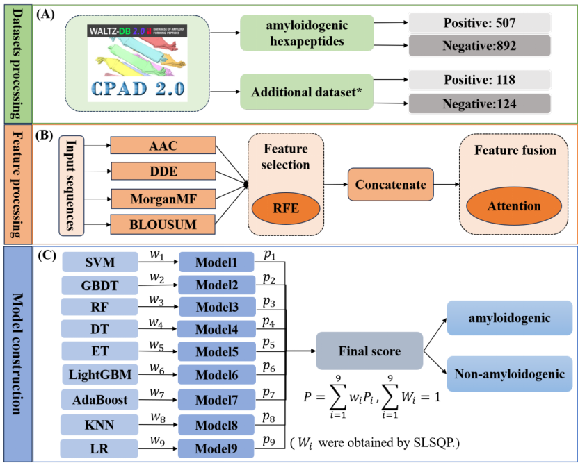

# iAmyP
iAmyP: a multi-view learning for amyloidogenic hexapeptides identification based on sequence least squares programming

## Introduction
This paper proposes a starch-like hexapeptide prediction model called iAmyP, which consists of three main steps:\
(1) Dataset acquisition and composition of positive and negative samples.\
(2) Feature processing: Four types of features (AAC, DDE, MorganFP, BLOUSUM) are used, including three perspectives. Recursive feature elimination is then employed for feature selection, followed by feature fusion using attention mechanisms.\
(3) Model construction: The Weighted Sequence Least Squares Algorithm (SLSQP) is utilized to minimize the logarithmic loss function, allocating weights to nine machine learning classifiers for integrated prediction.

The framework of the ETFC method for MFTP prediction is described as follows:


## Related Files

#### iAmyP

| FILE NAME              | DESCRIPTION                                                                             |
|:-----------------------|:----------------------------------------------------------------------------------------|
| data                   | Training dataset、Testing dataset、additional dataset(length of 7-10 AAs)                 
| AAC.py                 | Extract Amino Acid Composition feature                                                  |
| morganMF.py            | Extract Morgan fingerprint(MorganFP) feature                                            |
| DDE.py                 | Extract Dipeptide Deviation from Expected Mean(DDE) feature                             |
| BLOUSUM62.py           | Extract Blocks Subtitution Matrix(BLOUSUM) feature                                      |
| main.py                | the main file of iAmyP predictor                                                        |
| feature_filter.py      | Recursive Feature Elimination(RFE) for Feature Selection                                |
| SHAP.py                | The main module for computing SHAP values                                               |
| Stacking.py            | Stacking ensemble method                                                                |
| Majority voting.py     | Majority Voting ensemble method                                                         |
| Subsample Ensemble.py  | Subsample ensemble method                                                               |
| CW-Voting.py           | Confidence Weighted Voting method                                                       |
| EE-PSO.py              | Evolutionary Ensemble with Particle Swarm OPtimization method                           |
| Blending.py            | Blending Ensemble method                                                                |
| FBWW-SLSQP.py          | Feature Bagging with Weighted Weighting using SLSQP method |
| Hierarchical Voting.py | Hierarchical Voting Ensemble method                                                     |

## Installation
- Requirement

  OS：
  - `Windows` ：Windows10 or later

  Python：
  - `Python` >= 3.6
  Our code runs in the following corresponding versions of the python library, please make sure your environment is compatible with our version: <br />
  `torch==2.0.1+cu118`<br />
  `pandas==2.2.2`<br />
  `numpy ==1.26.4`<br />
  `scikit-learn ==1.5.0`<br />
  `scipy ==1.13.1`<br />
  `seaborn ==0.13.2`<br />
  `shap==0.41.0`<br />
- Download `iAmyP`to your computer

  ```bash
  git clone https://github.com/xialab-ahu/iAmyP.git
  ```

## Feature Selection
After feature extraction, use the following command in the project directory to perform feature selection:
```shell
cd ./iAmyP/model/
python feature_filter.py
```

## Training and test iAmyP model
In a run-time environment, in a project directory, train and test the model using the following commands:
```shell
cd ./iAmyP/model/
python main.py
```


## Contact
Please feel free to contact us if you need any help.
